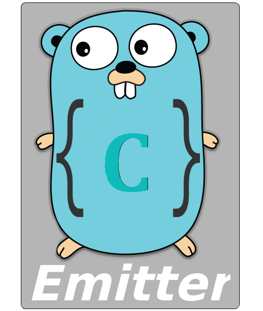

# **CGOEmitter** (golang package)

<center>
  
</center>
<center>


</center>

## What is it for?
The CGOEmitter package serves to obtain asynchronous **C** code response returns, facilitating the process of returning the data returned to the program in **GO**.

## How to use?

### 1. Create the C header file
You must include the **cgoemitter.h** file to obtain the required methods.

File: **(``github.com/user/packagename/x/x.h``)**
```c
#ifndef X_H_
#define X_H_

#include <stdlib.h>
#include <stddef.h>
#include <string.h>
#include "../../cgoemitter.h"

void say_message();

#endif
```

### 2. Create the C file with your logic
File: **(``github.com/user/packagename/x/x.c``)**

```c
#include "x.h"

void check_err_cgoemitter_args_halloc_arg(void* value) {
  if (value == NULL) puts("Failed on cgoemitter_args_halloc_arg()");
}

void check_err_cgoemitter_args_add_arg(int code) {
  if (code == EXIT_FAILURE) puts("Failed on cgoemitter_args_add_arg()");
}

void say_message() {
  char* message = "Parameter sent from C language";

  cgoemitter_args_t cgoemitter_args = cgoemitter_new_args(1);
  
  void* message_arg = cgoemitter_args_halloc_arg(&message, (strlen(message)+1) * sizeof(char));
  check_err_cgoemitter_args_halloc_arg(message_arg);
  check_err_cgoemitter_args_add_arg(cgoemitter_args_add_arg(&cgoemitter_args, &message_arg));

  emit("message", &cgoemitter_args);
}
```

### 3. Create the package that will call this method
It is extremely important to add the flags below so that your code is compiled.

```md
#cgo darwin LDFLAGS: -Wl,-undefined -Wl,dynamic_lookup
#cgo !darwin LDFLAGS: -Wl,-unresolved-symbols=ignore-all
```

File: **(``github.com/user/packagename/x/x.go``)**

```go
package x

// The LDFLAGS lines below are needed to prevent linker errors
// since not all packages are present while building intermediate
// packages. The darwin build tag is used as a proxy for clang
// versus gcc because there doesn't seem to be a better way
// to detect this.

/*
#cgo darwin LDFLAGS: -Wl,-undefined -Wl,dynamic_lookup
#cgo !darwin LDFLAGS: -Wl,-unresolved-symbols=ignore-all
#include "x.h"
*/
import "C"

//SayMessage | Execute C function
func SayMessage() {
  C.say_message()
}
```

### 4. Using the CGOEmitter to receive the returned data

File: **(``github.com/user/packagename/main.go``)**

```go
package main

import (
  "fmt"
  "github.com/supermock/cgoemitter"
  "github.com/user/packagename/x"
)

func main() {
  cgoemitter.On("message", cgoemitter.NewListener(func(args cgoemitter.Arguments) {
    fmt.Printf("Receveid message: %s\n", args.String(0))
  }))

  x.SayMessage()
}
```

### 5. Just run your program and see the magic happening

```sh
$ go run main.go
```

### Project with example of package usage: https://github.com/supermock/cgoemitter-demo

## Supported Methods:
- **On()** => Add a new listener to the event.
- **Off()** => Removes an existing listener in the event.
- **NewListener()** => Creates a new listener.
- **GetListeners()** => Returns all listeners to an event.
- **``parser``/CStructToGoStruct()** => Transports data from a structure received from C to a structure in the GO.

## Read in another language
[Clique aqui e leia em português](https://github.com/supermock/cgoemitter/blob/master/README-PT-BR.md)

## Contributions
Just download the code make your change and send a pull request explaining the purpose if it is a bug or an improvement and etc ... After this will be analyzed to be approved.

## License 
MIT